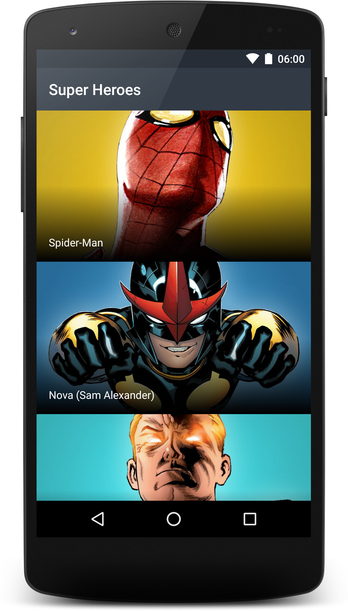
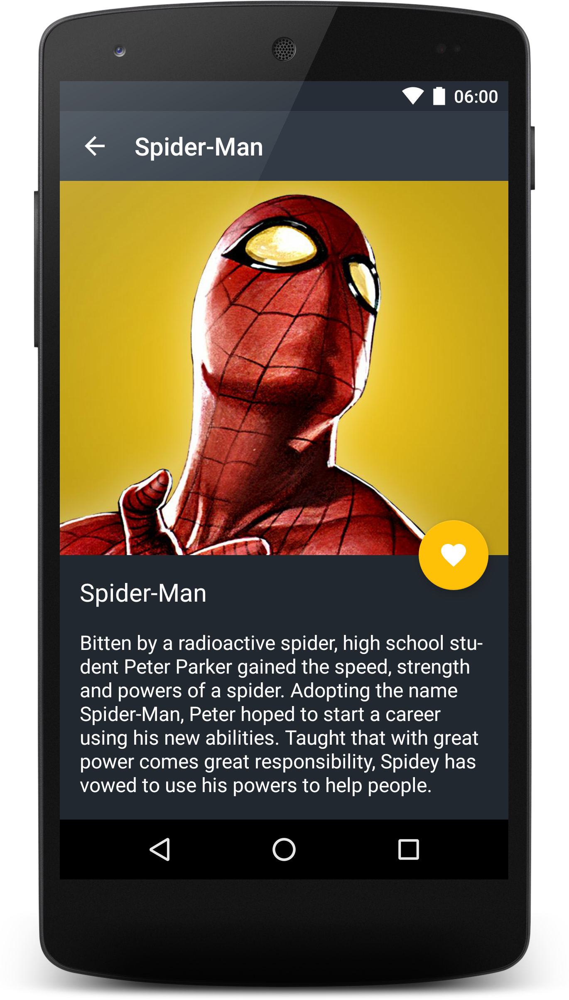

# Overview
The intention of this workshop is to learn about background processing in Android, and how to request data from external APIs. 

- Using AsyncTask for background work in Activities.
- Retrieve network data with OkHttp.
- Request data to a REST API using Retrofit.
- Store local data in SharedPreferences.

In this workshop we're not building a new project from scratch, but rather using a base project with a couple of activities and evolve it integrating the features above.

## The base project
We're building an application that lists Super Heroes retrieved from the Marvel API. Our base project has two Activities: 

- Super Heroes list (MainActivity): A list of images and names of the available super heroes.
- Super Hero Detail (SuperHeroDetailActivity): A detailed view of a single Super Hero, with bigger image, name and description.

The Super Heroes are retrieved from each Activity through a SuperHeroesRepository. In the base project this repository is implemented with fake data and a Thread.sleep() to simulate network delay.

MainActivity                        | SuperHeroDetailActivity
:----------------------------------:|:------------------------------:
 | 

# Companion slides
[Here!](slides/workshop4.pdf) 😃

# Step by Step
Every commit in the repo is an small individual step. You can check out the list of [commits](https://github.com/schibsted-android-training/workshop-4/commits/finished) to view the detailed process step by step.

# Contents
1. Base project: A two activity application which shows a list of super heroes and their detail | [e2d76bb8](https://github.com/schibsted-android-training/workshop-4/commit/e2d76bb882311b2c1524ca38553738a249e1a0a3)
2. Creating AsyncTasks for retrieving super heroes in background | [5738c511…31abbbb4](https://github.com/schibsted-android-training/workshop-4/compare/7fce09265c512f67c2b1769eebf0bd70249ce9da...31abbbb44d14fd0673b22cdd11ef94ae2fc8b469)
3. Requesting data from a real API using OkHttp | [dbb39f56](https://github.com/schibsted-android-training/workshop-4/commit/dbb39f5647b47a68bd5fd0216ebbab37238bb7d4)
4. Implementing the API with Retrofit 1.9 | [4e657c0a](https://github.com/schibsted-android-training/workshop-4/commit/4e657c0a57ca012f5a741cb4f3b7af8134d97347)
5. Storing and reading favorite super heroes with SharedPreferences | [73789d9e…44c98781](https://github.com/schibsted-android-training/workshop-4/compare/4e657c0a57ca012f5a741cb4f3b7af8134d97347...44c98781f21f349f4106f3fd498c9f3b950f0b98)

### Acknowledgment
The app's look and feel are based on [Karumi's SuperHeroes kata](https://github.com/Karumi/KataSuperHeroesAndroid). If you're interested in testing, check it out!
